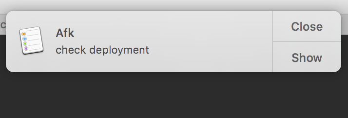

# Afk

A command-line tool called afk which gives you a simple reminder when you get back.

### Usage

```shell

> afk check deployment
```



### Instalation

```shell
pip install afk
```

### Notes:

- Works only for OSX
